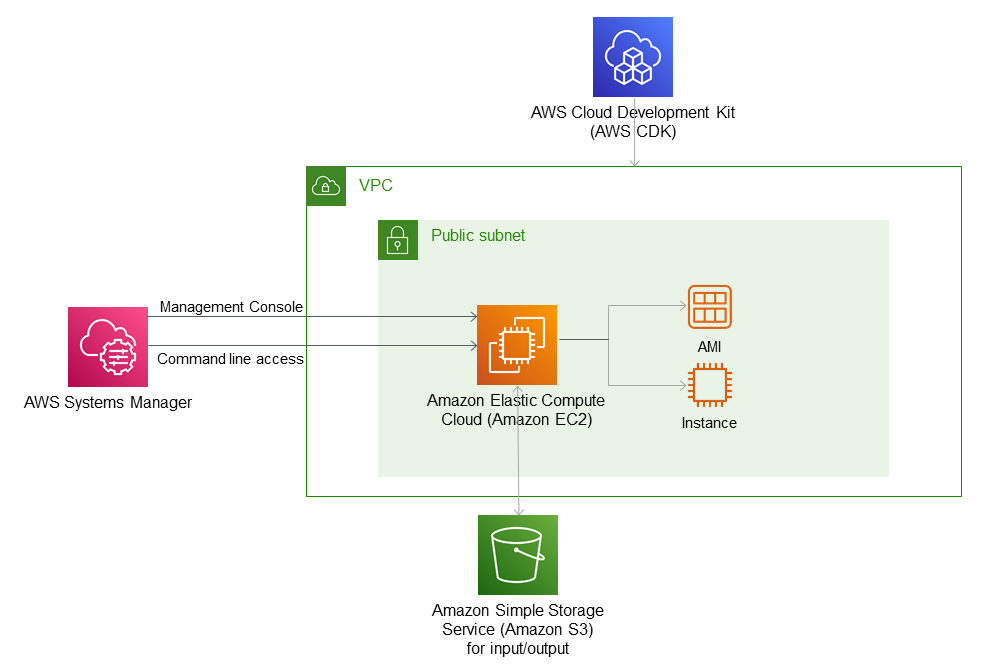

# Create EC2 Instance in new VPC with Systems Manager enabled
Based on the AWS example here:
https://github.com/aws-samples/aws-cdk-examples/tree/master/python/ec2/instance

This adaptation was originally intended for AI researchers who require bare-bones access to GPUs and includes:

* Own VPC with public subnet (following AWS Defaults for new accounts)
* System Manager replaces SSH (Remote session available through the AWS Console or the AWS CLI)
* Read/write access to S3 bucket for input/output
* Userdata executed from script (`startup.sh`)



Three alternatives to consider:
* If you do not need to use GPUs, please consider using AWS Fargate instead of EC2
* To save costs, please consider using EC2 Spot instances
* If you do not need bare-bones access, please consider SageMaker

**WARNING:** This architecture uses a public IP for the EC2 instance to access an S3 bucket. If you have sensitive data, please use a VPC endpoint instead. Also, enable encryption for EC2 storage volumes and consider more restrictive assumed roles.

## Setting up the environment
This example uses the Python version of AWS CDK (Cloud Development Kit). CDK allows you to create and use infrastructure in the AWS cloud from the command line of your local machine. If you are using Linux or MacOS, you can use a regular terminal window. If you are using a Windows machine, you can use Git Bash (https://gitforwindows.org/) or WSL (https://docs.microsoft.com/en-us/windows/wsl/install).

To set up CDK, read this first:
https://docs.aws.amazon.com/cdk/v2/guide/getting_started.html

and then this:
https://docs.aws.amazon.com/cdk/v2/guide/work-with.html#work-with-prerequisites

To access your AWS account from the command line, set up Single Sign on:
https://tu-delft-ict-innovation.github.io/Cloud4Research/faq/awscli.html#2-directly-from-your-laptop-or-desktop-computer

If you wish to access your EC2 instance with System Manager from the command line (instead of the AWS Console), then read this:
https://docs.aws.amazon.com/systems-manager/latest/userguide/session-manager-working-with-install-plugin.html

With everything set up, you can log into your AWS account using Single Sign On (SSO):
```
aws [--profile=optionalProfileName] sso login
```

## Using this example
Now you are ready to clone this git repository and step into it.

It is advisable to work in a Python virtual environment.
```
python -m venv .venv  # to create environment in hidden directory .venv/
```
If you are working on Windows (with Git Bash), activate the virtual environment with:
```
source .venv/Scripts/activate
```
otherwise:
```
source .venv/bin/activate
```
You will need to activate this environment every time you open a new shell.

Now that you are in the environment, install the requirements (only needs to be done once):
```
pip install -r requirements.txt
```
You can use `pytest` to check that everything is set up properly.

This example connects to the S3 bucket `s3://tudelft-results-of-calculations`. You do not have access to this bucket, so you will need to create a bucket of your own and change the name in `startup.sh` and in `app.py`.
It's good practice to restrict bucket access to only those who need it. You will be charged for data downloads. It's also good practice to encrypt the data in a bucket. Don't forget to tick the 'Enable' box.

See the [Useful Commands](#useful-commands) below to bootstrap your AWS CDK environment, synthesize a CloudFormation template from the Python code and deploy the template to your AWS environment.

## Now experiment!
You can specify the EC2 instance type, the AMI and the S3 bucket for input/output data in `app.py`.

You can specify the commands that will be run on startup in `startup.sh`. In the file provided, be sure to change the name of the S3 bucket. Shutting down at the end of the script means that you will no longer be charged for the EC2 instance, though there will be some charges for storage.

`docker_example_startup.sh` shows an example of how you could run a Docker container in this setup. The image has been 'tar-ed' using:
```
docker save <image_name> > <image_tar_name>.tar
```
and then copied to the S3 bucket.

A better solution would be to use Amazon Elastic Container Registry (ECR).

Note that the AMI used in `app.py` has Docker already installed. You may have to install it yourself, depending on the AMI you choose.

## Useful commands

 * `cdk bootstrap`   initialize assets before deploy
 * `cdk synth`       emits the synthesized CloudFormation template
 * `cdk deploy`      deploy this stack to your default AWS account/region
 * `aws ssm start-session --target i-xxxxxxxxx` remote session for shell access
 * `aws ec2 describe-instances | grep InstanceId` find target ID
 * `aws s3 cp <filename> s3://<bucket_name>` copy a file to an S3 bucket
 * `cdk destroy`     destroy this stack from your AWS account
